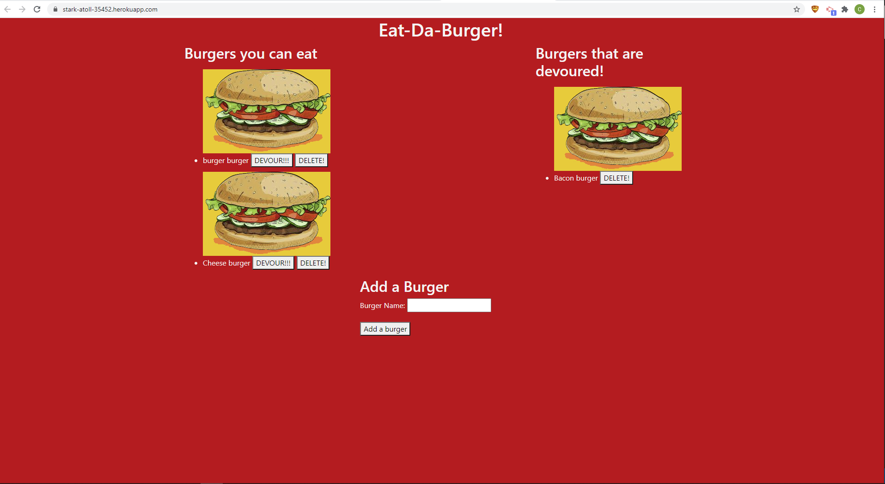

# Test
  

## Description

Created a burger logger with MySQL, Node, Express, Handlebars and a homemade ORM. You can add a new burger, devour burgers that are currently showing, or you can delete a burger.

## Table of Contents

* [installation](#installation)
* [usage](#usage)
* [license](#license)
* [contributing](#contributing)
* [test](#tests)
* [questions](#questions)

To install necessary dependencies run the following command

npm install

## Usage

Go to the link to the deployed site and enter new burgers or devour burgers that are already loaded.

## License
      
      This project is licensed under the MIT license.

## Contributing

N/A

## Tests
To run test run the following command:
'''
npm test
'''

## How the application works

## Questions
If you have any questions about the repo contact me directly at c.trahan94@yahoo.com.
You can find more of my work at [ctrahan94](https://github.com/ctrahan94).

